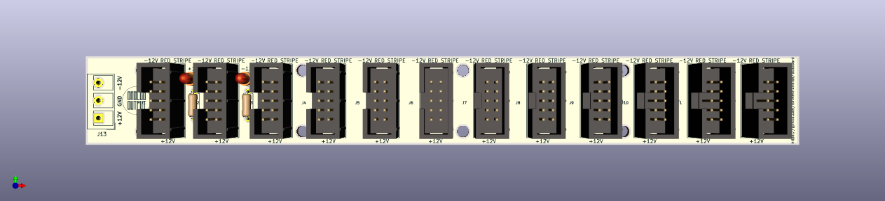

Eurorack/Kosmo Busboards
========================

* [busboard](busboard): A Eurorack power bus board in Kicad.
Size 31.5 x 200 mm.
* [busboard10](busboard10): 2x5 pin connector ±12V adaptation.
Size 25 x 200 mm.

